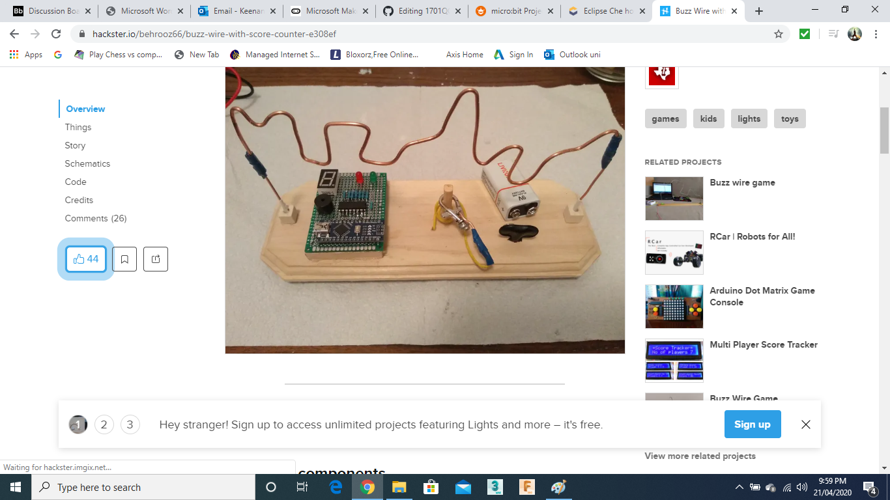
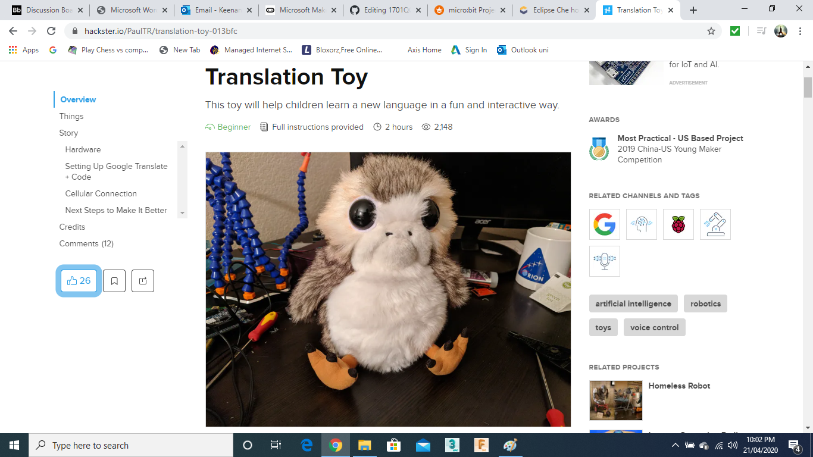
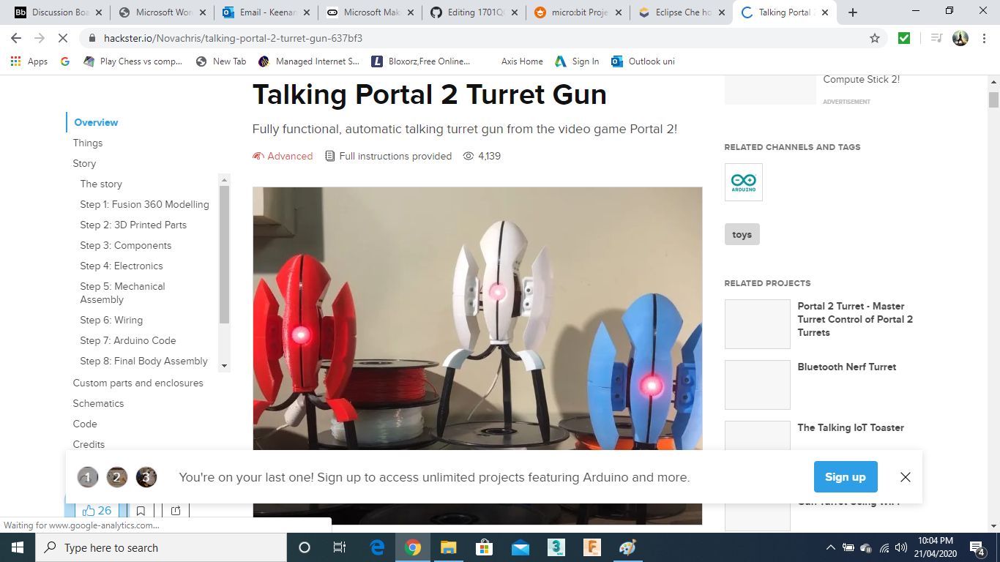

# Assessment 1: Replication project

*Fill out the following workbook with information relevant to your project.*

*Markdown reference:* [https://guides.github.com/features/mastering-markdown/](http://guides.github.com/features/mastering-markdown/)

## Replication project choice ##
1701QCA-Assessment 2

## Related projects ##
*Find about 6 related projects to the project you choose. A project might be related through  function, technology, materials, fabrication, concept, or code. Don't forget to place an image of the related project in the* `replicationproject` *folder and insert the filename in the appropriate places below. Copy the markdown block of code below for each project you are showing, updating the number* `1` *in the subtitle for each.*

### Related project 1 ###
Buzz Wire with score counter

https://www.hackster.io/behrooz66/buzz-wire-with-score-counter-e308ef

This project is related to mine because it is interactive and can be used as a toy. The project displays a wire which the user will go around.cThe user has a seperate wire and if the two connect, a loud sound is projected from the speaker in the form of a buzz. Meaning that they lost. 

### Related project 2 ###
Plush Toy Translator

https://www.hackster.io/PaulTR/translation-toy-013bfc

This project is relate to mine because it has very similar aspects being a plush toy and being able to interact with it. In this case the user is able to speak to it and it translates the voice although the project is a little more advanced it has a similar outcome where the user is able to play with the toy and learn something new. 

### Related project 3 ###
Portal 2 talking Turret

https://www.hackster.io/Novachris/talking-portal-2-turret-gun-637bf3

This project is related to mine because it has the speaker aspect to the toy. It isn't that interactive with playing and shaking though it just talks like a robot from the video game portal. 

### Related project 4 ###
Buddy the 3D-Printed Arduino Social Robot

https://create.arduino.cc/projecthub/slantconcepts/buddy-the-3d-printed-arduino-social-robot-ec3dca?ref=tag&ref_id=toys&offset=23

This project is related to mine because it is a toy that has a social aspect to it. My project also has a social aspect to it as it answers questions you can ask it and will give a answer. The buddy social robot is considered to be 'alive' in a way as it moves and looks around the room. My bear will also be considered 'alive' as it creates sounds when shaked and also answers questions. 

### Related project 5 ###
Magic 8 Ball

https://www.instructables.com/id/Digital-Magic-8-Ball/

This project is related to mine because it is similar in interaction and it answers questions people ask. The difference is mine is in the form or a teddy bear and the user's answers are yes or no, not with a few words. 

### Related project 6 ###
Portal 2 talking Turret

https://www.hackster.io/Novachris/talking-portal-2-turret-gun-637bf3

This project is related to mine because it has the speaker aspect to the toy. It isn't that interactive with playing and shaking though it just talks like a robot from a video game. 

## Interaction flowchart ##
*Draw a flowchart of the interaction process in your project. Make sure you think about all the stages of interaction step-by-step. Also make sure that you consider actions a user might take that aren't what you intend in an ideal use case. Insert an image of it below. It might just be a photo of a hand-drawn sketch, not a carefully drawn digital diagram. It just needs to be legible.*

## Process documentation

*In this section, include text and images that represent the development of your project including sources you've found (URLs and written references), choices you've made, sketches you've done, iterations completed, materials you've investigated, and code samples. Use the markdown reference for help in formatting the material.*

*This should have quite a lot of information!*

*There will likely by a dozen or so images of the project under construction. The images should help explain why you've made the choices you've made as well as what you have done. Use the code below to include images, and copy it for each image, updating the information for each.*

*Include screenshots of the code you have used.*

## Project outcome ##

*Complete the following information.*

### Project title ###

### Project description ###

*In a few sentences, describe what the project is and does, who it is for, and a typical use case.*

### Showcase image ###

*Try to capture the image as if it were in a portfolio, sales material, or project proposal. The project isn't likely to be something that finished, but practice making images that capture the project in that style.*

### Additional view ###

*Provide some other image that gives a viewer a different perspective on the project such as more about how it functions, the project in use, or something else.*

### Reflection ###

*Describe the parts of your project you felt were most successful and the parts that could have done with improvement, whether in terms of outcome, process, or understanding.*

*What techniques, approaches, skills, or information did you find useful from other sources (such as the related projects you identified earlier)?*

*What ideas have you read, heard, or seen that informed your thinking on this project? (Provide references.)*

*What might be an interesting extension of this project? In what other contexts might this project be used?*
